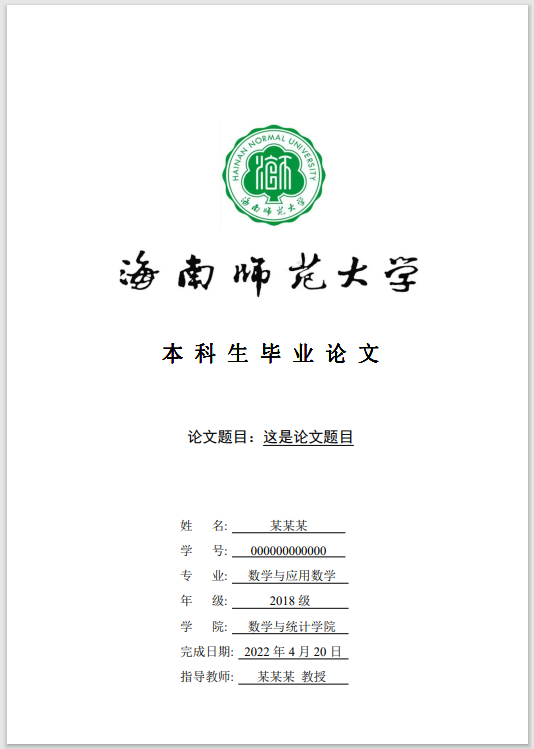
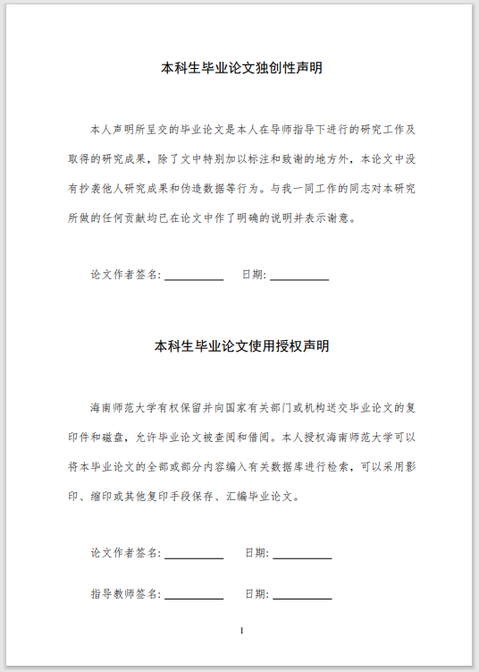
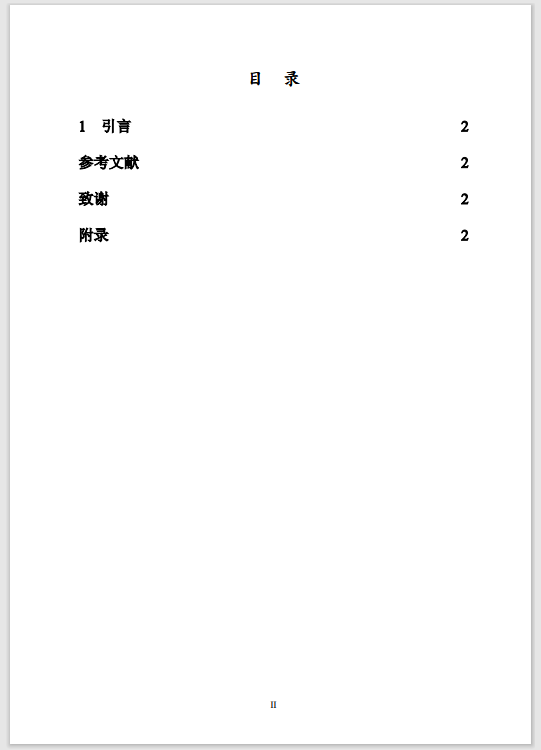
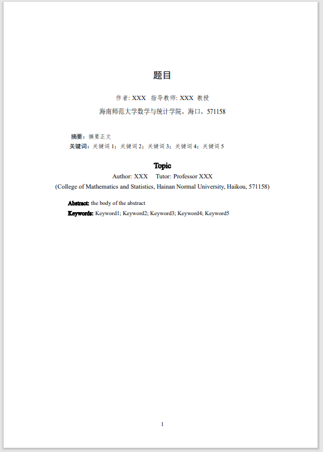
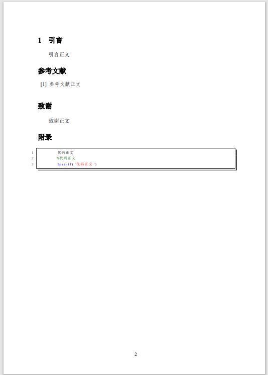

# Hainnu Undergraduate Thesis
This template is used for the Hainan Normal University undergraduate thesis, especially for college of mathematics and statistics. It includes how to insert the texts, figures, tables and formulas into the LaTeX for the students.

海南师范大学本科毕业论文LaTeX模板

如果本文有bug问题或其他问题，可联系邮箱forhheart5532@gmail.com

环境为Texlive2022 windows

编辑器为Texstudio 6.2.3 qt6

